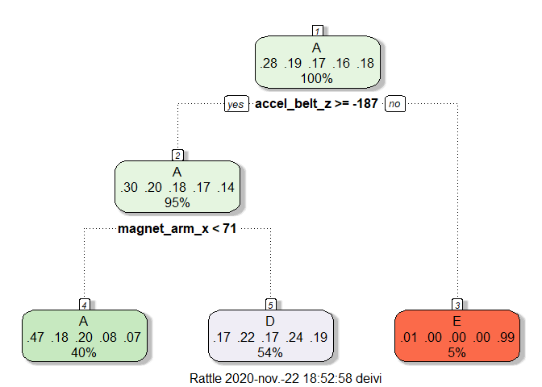
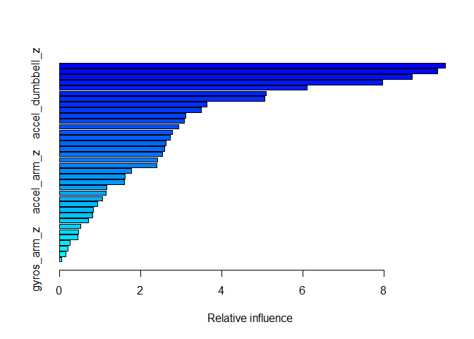

# Abstract

Using devices such as Jawbone Up, Nike FuelBand, and Fitbit it is now possible to collect a large amount of data about personal activity relatively inexpensively. These type of devices are part of the quantified self movement – a group of enthusiasts who take measurements about themselves regularly to improve their health, to find patterns in their behavior, or because they are tech geeks. One thing that people regularly do is quantify how much of a particular activity they do, but they rarely quantify how well they do it. We will use data from accelerometers on the belt, forearm, arm, and dumbell of 6 participants. They were asked to perform barbell lifts correctly and incorrectly in 5 different ways.

# Goal

The goal of this project is to predict the manner in which they did the exercise. This is the "classe" variable in the training set:
* exactly according to the specification (Class A).  
* throwing the elbows to the front (Class B).  
* lifting the dumbbell only halfway (Class C).  
* lowering the dumbbell only halfway (Class D).  
* throwing the hips to the front (Class E).  

# Data

First, we will download the training and test data.

```r
if(!file.exists("pml-training.csv"))
download.file("https://d396qusza40orc.cloudfront.net/predmachlearn/pml-training.csv","pml-training.csv")
if(!file.exists("pml-testing.csv"))
    download.file("https://d396qusza40orc.cloudfront.net/predmachlearn/pml-testing.csv","pml-testing.csv")
training <- read.csv("pml-training.csv")
testing <- read.csv("pml-testing.csv")
```
If we take a first look to the data, we can remove some unnecesary variables that will not be necessary to our model. We will only consider variables related to measurements in x,y,z axis.

```r
names(training)
```

```
##   [1] "X"                        "user_name"               
##   [3] "raw_timestamp_part_1"     "raw_timestamp_part_2"    
##   [5] "cvtd_timestamp"           "new_window"              
##   [7] "num_window"               "roll_belt"               
##   [9] "pitch_belt"               "yaw_belt"                
##  [11] "total_accel_belt"         "kurtosis_roll_belt"      
##  [13] "kurtosis_picth_belt"      "kurtosis_yaw_belt"       
##  [15] "skewness_roll_belt"       "skewness_roll_belt.1"    
##  [17] "skewness_yaw_belt"        "max_roll_belt"           
##  [19] "max_picth_belt"           "max_yaw_belt"            
##  [21] "min_roll_belt"            "min_pitch_belt"          
##  [23] "min_yaw_belt"             "amplitude_roll_belt"     
##  [25] "amplitude_pitch_belt"     "amplitude_yaw_belt"      
##  [27] "var_total_accel_belt"     "avg_roll_belt"           
##  [29] "stddev_roll_belt"         "var_roll_belt"           
##  [31] "avg_pitch_belt"           "stddev_pitch_belt"       
##  [33] "var_pitch_belt"           "avg_yaw_belt"            
##  [35] "stddev_yaw_belt"          "var_yaw_belt"            
##  [37] "gyros_belt_x"             "gyros_belt_y"            
##  [39] "gyros_belt_z"             "accel_belt_x"            
##  [41] "accel_belt_y"             "accel_belt_z"            
##  [43] "magnet_belt_x"            "magnet_belt_y"           
##  [45] "magnet_belt_z"            "roll_arm"                
##  [47] "pitch_arm"                "yaw_arm"                 
##  [49] "total_accel_arm"          "var_accel_arm"           
##  [51] "avg_roll_arm"             "stddev_roll_arm"         
##  [53] "var_roll_arm"             "avg_pitch_arm"           
##  [55] "stddev_pitch_arm"         "var_pitch_arm"           
##  [57] "avg_yaw_arm"              "stddev_yaw_arm"          
##  [59] "var_yaw_arm"              "gyros_arm_x"             
##  [61] "gyros_arm_y"              "gyros_arm_z"             
##  [63] "accel_arm_x"              "accel_arm_y"             
##  [65] "accel_arm_z"              "magnet_arm_x"            
##  [67] "magnet_arm_y"             "magnet_arm_z"            
##  [69] "kurtosis_roll_arm"        "kurtosis_picth_arm"      
##  [71] "kurtosis_yaw_arm"         "skewness_roll_arm"       
##  [73] "skewness_pitch_arm"       "skewness_yaw_arm"        
##  [75] "max_roll_arm"             "max_picth_arm"           
##  [77] "max_yaw_arm"              "min_roll_arm"            
##  [79] "min_pitch_arm"            "min_yaw_arm"             
##  [81] "amplitude_roll_arm"       "amplitude_pitch_arm"     
##  [83] "amplitude_yaw_arm"        "roll_dumbbell"           
##  [85] "pitch_dumbbell"           "yaw_dumbbell"            
##  [87] "kurtosis_roll_dumbbell"   "kurtosis_picth_dumbbell" 
##  [89] "kurtosis_yaw_dumbbell"    "skewness_roll_dumbbell"  
##  [91] "skewness_pitch_dumbbell"  "skewness_yaw_dumbbell"   
##  [93] "max_roll_dumbbell"        "max_picth_dumbbell"      
##  [95] "max_yaw_dumbbell"         "min_roll_dumbbell"       
##  [97] "min_pitch_dumbbell"       "min_yaw_dumbbell"        
##  [99] "amplitude_roll_dumbbell"  "amplitude_pitch_dumbbell"
## [101] "amplitude_yaw_dumbbell"   "total_accel_dumbbell"    
## [103] "var_accel_dumbbell"       "avg_roll_dumbbell"       
## [105] "stddev_roll_dumbbell"     "var_roll_dumbbell"       
## [107] "avg_pitch_dumbbell"       "stddev_pitch_dumbbell"   
## [109] "var_pitch_dumbbell"       "avg_yaw_dumbbell"        
## [111] "stddev_yaw_dumbbell"      "var_yaw_dumbbell"        
## [113] "gyros_dumbbell_x"         "gyros_dumbbell_y"        
## [115] "gyros_dumbbell_z"         "accel_dumbbell_x"        
## [117] "accel_dumbbell_y"         "accel_dumbbell_z"        
## [119] "magnet_dumbbell_x"        "magnet_dumbbell_y"       
## [121] "magnet_dumbbell_z"        "roll_forearm"            
## [123] "pitch_forearm"            "yaw_forearm"             
## [125] "kurtosis_roll_forearm"    "kurtosis_picth_forearm"  
## [127] "kurtosis_yaw_forearm"     "skewness_roll_forearm"   
## [129] "skewness_pitch_forearm"   "skewness_yaw_forearm"    
## [131] "max_roll_forearm"         "max_picth_forearm"       
## [133] "max_yaw_forearm"          "min_roll_forearm"        
## [135] "min_pitch_forearm"        "min_yaw_forearm"         
## [137] "amplitude_roll_forearm"   "amplitude_pitch_forearm" 
## [139] "amplitude_yaw_forearm"    "total_accel_forearm"     
## [141] "var_accel_forearm"        "avg_roll_forearm"        
## [143] "stddev_roll_forearm"      "var_roll_forearm"        
## [145] "avg_pitch_forearm"        "stddev_pitch_forearm"    
## [147] "var_pitch_forearm"        "avg_yaw_forearm"         
## [149] "stddev_yaw_forearm"       "var_yaw_forearm"         
## [151] "gyros_forearm_x"          "gyros_forearm_y"         
## [153] "gyros_forearm_z"          "accel_forearm_x"         
## [155] "accel_forearm_y"          "accel_forearm_z"         
## [157] "magnet_forearm_x"         "magnet_forearm_y"        
## [159] "magnet_forearm_z"         "classe"
```

```r
xyzattr <- names(training)[grepl("x$|y$|z$",names(training))]
testingData <- testing[,xyzattr]
xyzattr <- c(xyzattr,"classe")
trainingData <- training[,xyzattr]
trainingData$classe <- as.factor(trainingData$classe)
```

# Models

## Recursive Partitioning  
Recursive partitioning is a statistical method for multivariable analysis. Recursive partitioning creates a decision tree that strives to correctly classify members of the population by splitting it into sub-populations based on several dichotomous independent variables. The process is termed recursive because each sub-population may in turn be split an indefinite number of times until the splitting process terminates after a particular stopping criterion is reached. [4]


```r
tree.fit <- train(classe ~. , method="rpart", data=trainingData)
prediccion.tree <- predict(tree.fit,newdata=trainingData)
fancyRpartPlot(tree.fit$finalModel)
```

<!-- -->

We can see the decision tree above.

```r
(conf.tree <- confusionMatrix(prediccion.tree,trainingData[,"classe"]) )
```

```
## Confusion Matrix and Statistics
## 
##           Reference
## Prediction    A    B    C    D    E
##          A 3711 1436 1560  640  560
##          B    0    0    0    0    0
##          C    0    0    0    0    0
##          D 1863 2360 1862 2576 2019
##          E    6    1    0    0 1028
## 
## Overall Statistics
##                                          
##                Accuracy : 0.3728         
##                  95% CI : (0.366, 0.3796)
##     No Information Rate : 0.2844         
##     P-Value [Acc > NIR] : < 2.2e-16      
##                                          
##                   Kappa : 0.2025         
##                                          
##  Mcnemar's Test P-Value : NA             
## 
## Statistics by Class:
## 
##                      Class: A Class: B Class: C Class: D Class: E
## Sensitivity            0.6651   0.0000   0.0000   0.8010  0.28500
## Specificity            0.7012   1.0000   1.0000   0.5060  0.99956
## Pos Pred Value         0.4693      NaN      NaN   0.2412  0.99324
## Neg Pred Value         0.8405   0.8065   0.8256   0.9284  0.86125
## Prevalence             0.2844   0.1935   0.1744   0.1639  0.18382
## Detection Rate         0.1891   0.0000   0.0000   0.1313  0.05239
## Detection Prevalence   0.4030   0.0000   0.0000   0.5443  0.05275
## Balanced Accuracy      0.6831   0.5000   0.5000   0.6535  0.64228
```
And some statistics about this model. For example, we have achieved a bad accuracy (``0.3727958``) and no information rate of (``0.2843747``)  

## Random forest
Random forests or random decision forests are an ensemble learning method for classification, regression and other tasks that operate by constructing a multitude of decision trees at training time and outputting the class that is the mode of the classes (classification) or mean/average prediction (regression) of the individual trees.[5]

```r
fitControl <- trainControl(method = "cv", number = 5, allowParallel = TRUE)
rf.fit <- train(classe ~ ., method="rf",data=trainingData,trControl = fitControl,ntree=500)
prediccion.rf <- predict(rf.fit,newdata=trainingData)
(conf.rf <- confusionMatrix(prediccion.rf,trainingData[,"classe"]) )
```

```
## Confusion Matrix and Statistics
## 
##           Reference
## Prediction    A    B    C    D    E
##          A 5580    0    0    0    0
##          B    0 3797    0    0    0
##          C    0    0 3422    0    0
##          D    0    0    0 3216    0
##          E    0    0    0    0 3607
## 
## Overall Statistics
##                                      
##                Accuracy : 1          
##                  95% CI : (0.9998, 1)
##     No Information Rate : 0.2844     
##     P-Value [Acc > NIR] : < 2.2e-16  
##                                      
##                   Kappa : 1          
##                                      
##  Mcnemar's Test P-Value : NA         
## 
## Statistics by Class:
## 
##                      Class: A Class: B Class: C Class: D Class: E
## Sensitivity            1.0000   1.0000   1.0000   1.0000   1.0000
## Specificity            1.0000   1.0000   1.0000   1.0000   1.0000
## Pos Pred Value         1.0000   1.0000   1.0000   1.0000   1.0000
## Neg Pred Value         1.0000   1.0000   1.0000   1.0000   1.0000
## Prevalence             0.2844   0.1935   0.1744   0.1639   0.1838
## Detection Rate         0.2844   0.1935   0.1744   0.1639   0.1838
## Detection Prevalence   0.2844   0.1935   0.1744   0.1639   0.1838
## Balanced Accuracy      1.0000   1.0000   1.0000   1.0000   1.0000
```
We have 'overfitted' our model, as we can see we have ``1`` accuracy. We can predict all the classes from every sample.

## Gradient Boosting
Gradient boosting is a machine learning technique for regression and classification problems. It produces a prediction model in the form of an ensemble of weak prediction models, typically decision trees.[6]

```r
gbm.fit <- train(classe ~ ., method="gbm",data=trainingData,trControl = fitControl, verbose=FALSE)
prediccion.gbm <- predict(gbm.fit,newdata=trainingData)
(conf.gbm <- confusionMatrix(prediccion.gbm,trainingData[,"classe"]) )
```

```
## Confusion Matrix and Statistics
## 
##           Reference
## Prediction    A    B    C    D    E
##          A 5438  234   83   66   17
##          B   30 3329  128   22   76
##          C   43  189 3158  211   75
##          D   61   23   43 2875   76
##          E    8   22   10   42 3363
## 
## Overall Statistics
##                                           
##                Accuracy : 0.9256          
##                  95% CI : (0.9219, 0.9293)
##     No Information Rate : 0.2844          
##     P-Value [Acc > NIR] : < 2.2e-16       
##                                           
##                   Kappa : 0.9058          
##                                           
##  Mcnemar's Test P-Value : < 2.2e-16       
## 
## Statistics by Class:
## 
##                      Class: A Class: B Class: C Class: D Class: E
## Sensitivity            0.9746   0.8767   0.9229   0.8940   0.9324
## Specificity            0.9715   0.9838   0.9680   0.9876   0.9949
## Pos Pred Value         0.9315   0.9286   0.8591   0.9340   0.9762
## Neg Pred Value         0.9897   0.9708   0.9834   0.9794   0.9849
## Prevalence             0.2844   0.1935   0.1744   0.1639   0.1838
## Detection Rate         0.2771   0.1697   0.1609   0.1465   0.1714
## Detection Prevalence   0.2975   0.1827   0.1873   0.1569   0.1756
## Balanced Accuracy      0.9730   0.9303   0.9454   0.9408   0.9636
```
We will chose this model because we have a low in sample error of ``7.4355315`` % and we have reduced the overfitting.


```r
summary(gbm.fit)
```

<!-- -->

```
##                                 var    rel.inf
## accel_belt_z           accel_belt_z 9.51377410
## magnet_dumbbell_z magnet_dumbbell_z 9.32648952
## magnet_dumbbell_y magnet_dumbbell_y 8.69222367
## magnet_belt_z         magnet_belt_z 7.95542476
## gyros_belt_z           gyros_belt_z 6.11006485
## accel_dumbbell_z   accel_dumbbell_z 5.10133028
## accel_dumbbell_y   accel_dumbbell_y 5.05363186
## accel_forearm_x     accel_forearm_x 3.63103447
## magnet_dumbbell_x magnet_dumbbell_x 3.50599844
## magnet_belt_y         magnet_belt_y 3.11138477
## magnet_arm_z           magnet_arm_z 3.08365775
## magnet_arm_x           magnet_arm_x 2.94120362
## magnet_belt_x         magnet_belt_x 2.77957132
## accel_forearm_z     accel_forearm_z 2.72492571
## accel_dumbbell_x   accel_dumbbell_x 2.63085311
## magnet_forearm_x   magnet_forearm_x 2.58827675
## accel_arm_x             accel_arm_x 2.53408242
## gyros_dumbbell_y   gyros_dumbbell_y 2.42544871
## magnet_arm_y           magnet_arm_y 2.40479090
## magnet_forearm_z   magnet_forearm_z 1.77225167
## gyros_belt_y           gyros_belt_y 1.62860311
## accel_arm_z             accel_arm_z 1.61021813
## gyros_arm_y             gyros_arm_y 1.16610959
## magnet_forearm_y   magnet_forearm_y 1.15685734
## gyros_belt_x           gyros_belt_x 1.05964782
## accel_forearm_y     accel_forearm_y 0.93963313
## gyros_arm_x             gyros_arm_x 0.84751592
## accel_belt_x           accel_belt_x 0.82234930
## gyros_dumbbell_x   gyros_dumbbell_x 0.72179943
## gyros_forearm_y     gyros_forearm_y 0.52308977
## gyros_dumbbell_z   gyros_dumbbell_z 0.46674676
## accel_arm_y             accel_arm_y 0.45776253
## gyros_forearm_z     gyros_forearm_z 0.27253094
## accel_belt_y           accel_belt_y 0.20927000
## gyros_forearm_x     gyros_forearm_x 0.16743461
## gyros_arm_z             gyros_arm_z 0.06401294
```
We can see in the figure from above the relative influence of the variables.

# Prediction

Now that we have choosen our model we will predict the classe of the testing set.  


```r
predict(gbm.fit,newdata=testingData)
```

```
##  [1] A A B A A E D B A A B C B A E E A B B B
## Levels: A B C D E
```

# Bibliography 
[1] [Velloso, E.; Bulling, A.; Gellersen, H.; Ugulino, W.; Fuks, H. Qualitative Activity Recognition of Weight Lifting Exercises. Proceedings of 4th International Conference in Cooperation with SIGCHI (Augmented Human '13) . Stuttgart, Germany: ACM SIGCHI, 2013.](http://groupware.les.inf.puc-rio.br/public/papers/2013.Velloso.QAR-WLE.pdf)  
[2] [Mandy Sidana. Intro to types of classification algorithms in Machine Learning(Feb 28, 2017)](https://medium.com/sifium/machine-learning-types-of-classification-9497bd4f2e14)  
[3] [Harshdeep Singh, Understanding Gradient Boosting Machines(Nov 3, 2018)](https://towardsdatascience.com/understanding-gradient-boosting-machines-9be756fe76ab)  
[4] [Recursive Partitioning, Wikipedia](https://en.wikipedia.org/wiki/Recursive_partitioning)  
[5] [Random forests, Wikipedia](https://en.wikipedia.org/wiki/Random_forest)  
[6] [Gradient Boosting, Wikipedia](https://en.wikipedia.org/wiki/Gradient_boosting)  
